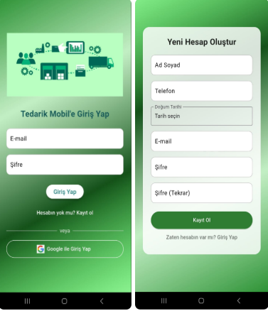
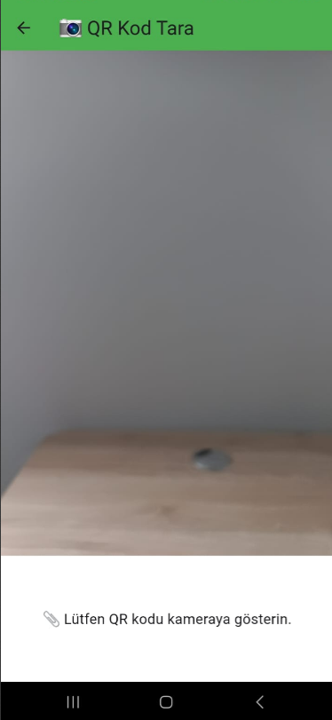
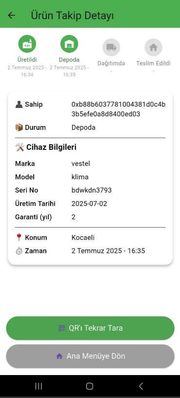
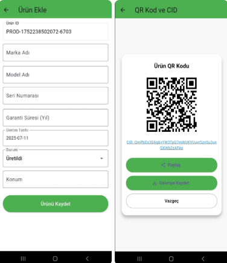
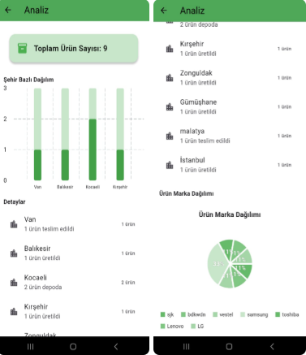
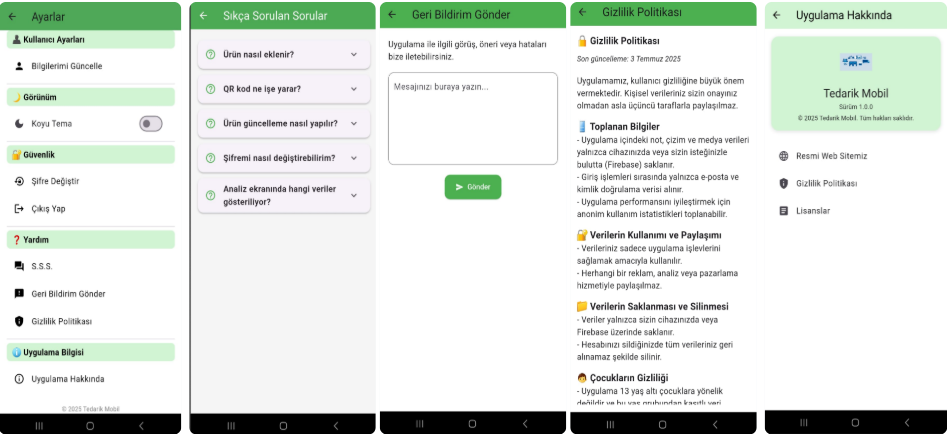

# Blockchain Supply Chain Mobile App

> 🇹🇷 Flutter, IPFS ve Blockchain teknolojileri kullanılarak geliştirilen; ürünlerin üretimden teslimata kadar olan süreçlerini şeffaf, güvenli ve doğrulanabilir şekilde takip etmeyi amaçlayan mobil tedarik zinciri uygulaması.

A Flutter-based mobile supply chain tracking application that combines QR code verification, IPFS-based decentralized data access, blockchain-based validation, producer authorization, product management and analytics features in a single mobile experience.

---

## Project Overview

This project was developed to improve transparency, traceability and trust in supply chain processes. The application allows users to verify product information by scanning QR codes, while authorized producers can add and update product records through a secure mobile interface.

Product-related data can be accessed through IPFS, while blockchain-based validation supports data integrity and traceability. The application also provides product management workflows, recent transaction tracking, analytics screens and secure access features.

The goal of the project is to make product history more transparent from production to delivery by combining decentralized technologies with a user-friendly mobile application.

---

## Project Highlights

- Flutter-based cross-platform mobile application
- QR code-based product verification
- IPFS-based decentralized product data access
- Blockchain-supported product validation approach
- Producer authentication and authorization flow
- Product creation and update workflows
- Supply chain status tracking
- Product detail visualization
- Recent actions / transaction history tracking
- Product analytics by brand and city
- Light and dark theme support
- Navigation drawer with user profile information
- Secure token-based access flow
- Session management and login control
- Modern and user-friendly mobile UI

---

## Main Features

### QR Code Product Verification

Users can scan the QR code on a product to access product-related information. This allows users to verify product details and inspect supply chain data more transparently.

The QR-based verification flow helps make product history accessible and easy to validate from a mobile device.

### Product Management

Authorized producers can add new products or update existing product records.

Product management features include:

- Product creation
- Product update
- Producer-based access control
- QR code generation / sharing workflow
- Product status management
- Product detail tracking

### Supply Chain Tracking

The application supports tracking product states across the supply chain process.

Example product states include:

- Production
- Packaging
- Storage
- Shipment
- Delivery

This structure helps create a more traceable and transparent product journey.

### IPFS & Blockchain-Based Validation

The application combines IPFS and blockchain concepts to support decentralized and verifiable product data management.

- IPFS is used for decentralized data access.
- Blockchain-based validation supports transparency and data integrity.
- QR codes connect physical products with digital records.

### Analytics Dashboard

The analytics screen visualizes product distribution and activity data.

Analytics features include:

- Brand-based product distribution
- City-based product distribution
- Product statistics
- Visual charts for easier interpretation

### Recent Actions

The application includes a recent actions section where users can view recent product-related operations.

This improves traceability and helps users monitor product management activity.

### Security & Access Control

The application includes several security-focused mechanisms:

- Firebase Authentication
- Producer identity control
- Secure login flow
- Session management
- Token-based access
- Role-based product update logic
- Safe logout flow

### Theme & User Experience

The application supports both light and dark themes. The navigation drawer provides user profile information, role details, security badge information and access to settings.

---

## Technologies Used

- Flutter
- Dart
- IPFS
- Blockchain
- Firebase Authentication
- QR Code Scanner
- QR Code Generation
- Secure session management
- Local storage
- Chart / analytics visualization
- Mobile UI / UX design

---

## Screenshots

| Login & Register | QR Product Scan | Product Detail |
|---|---|---|
|  |  |  |

| Product Management | Analytics Dashboard | Settings | 
|---|---|---|
|  |  |  |

> Screenshots were captured using demo data.

---

## Suggested Screenshot Files

To make the README display correctly, upload screenshots under:

```text
docs/screenshots/
